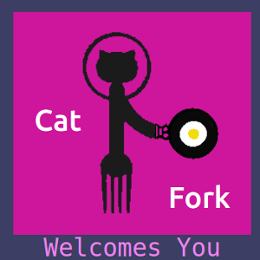
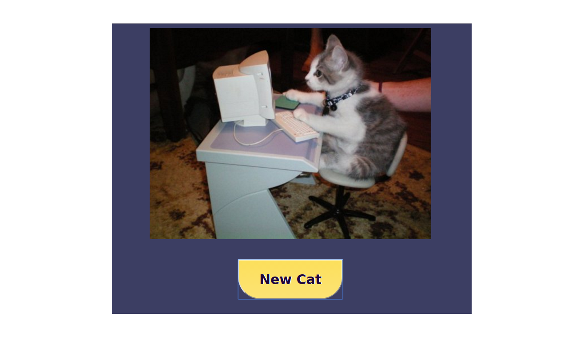
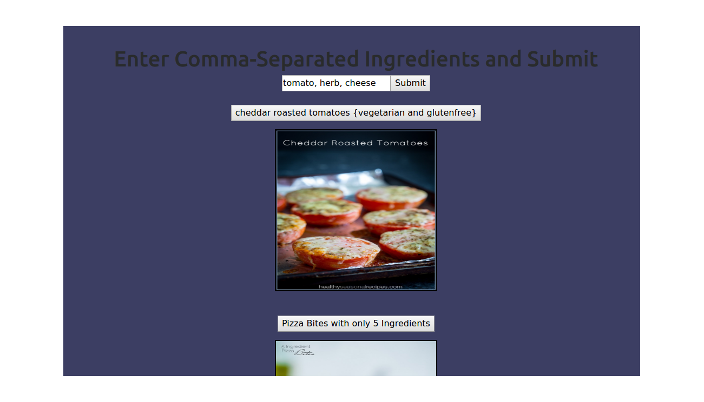
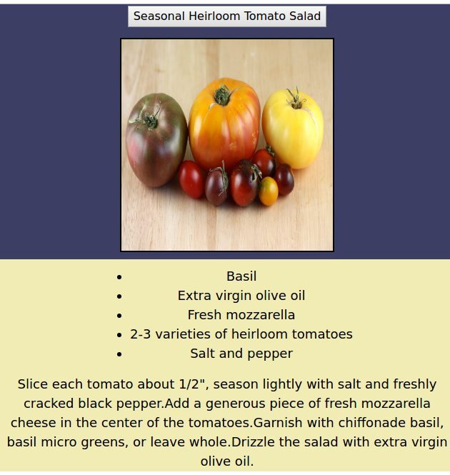

# CatFork!
  I put the logo together using GIMP
 
This is an app I built as my capstone project at the Austin Coding Academy in the second half of 2017. I used JS6, HTML5, CSS3, Babel and JSX using the React library to deliver a recipe search experience based on enterable ingredients. The process relies on 2 API calls. The substance or "fork" is the call to the [Spoonacular](https://spoonacular.com) api, querying the ingredients and returning the recipes. The second is the "cat" from the [catApi](https://www.thecatapi.com) ...because the internet. 

I am in the process of migrating the app to Firebase so these pictures will have to satisfy your curiosity for now. 
  __CATS!__

  __MMMMMM Tomato Cheese and Herbs!__
 
 __OOOh Look at the Recipes!__ 
 __That heirloom salad looks great! If I press the button....__
 
__Yay CatFork!__

 
That's CatFork! An excellent excercise in the handling of API calls and URL variables using javascript and the React libary.
Not a bad recipe app either. I'm expanding the functionality to include:
* Login/User Base - this is in process using Google Auth  - 
* Favorite Recipe/Cats Folders
* Expanding Search Functionality To Include Nutritional Info, Cusine, Ingredient Substitution
* Ingredient/Recipe Conversion, Including Pan-Size Adjustment For Things In Rimmed Pans! (something I've always wanted)
* Long Term is adding the ability to create your own recipe and minting an ERC-1155 Non-Fungible Token as a way to memorialize it and the ability to add it to the Catfork Recipe Vault.

